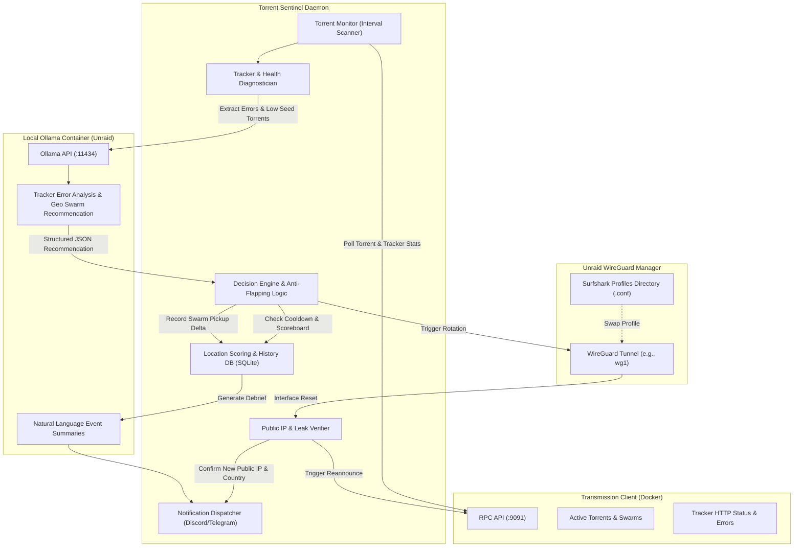

# Torrent Sentinel: Automated VPN Rotation & Torrent Health Monitor (with Local Ollama AI)

Build **Torrent Sentinel**, an intelligent daemon and management service designed to run on Unraid (or Docker) that monitors the Transmission torrent client, detects stalled downloads caused by VPN tracker blocking/shadow-banning, automatically rotates through Surfshark VPN server locations, and re-announces torrents to discover healthy peer swarms.

---

## User Feedback & Refinements Incorporated

Based on your comments, the plan has been refined with three major pillars:

1. **Local Ollama Integration on Unraid (`ollama` Docker):**
   - You have Ollama already running locally in Docker on Unraid!
   - **Zero API cost, 100% private, zero external dependencies.**
   - Ollama acts as the **AI Diagnostic & Reasoning Engine**:
     - Analyzes cryptic tracker error messages (e.g., HTTP 403, 429, timeouts, Cloudflare challenges, scraper responses).
     - Analyzes torrent content types (release groups, language, private vs. public trackers) to determine optimal geographic regions (e.g., European vs. North American swarms).
     - Outputs structured JSON recommendations for rotation and generates human-readable incident debriefs for Discord/Telegram/logs.
     - **Resilient Fallback:** If Ollama is busy, updating, or temporarily unavailable, Sentinel smoothly falls back to its deterministic statistical scoreboard so torrent monitoring never stops.

2. **Easiest VPN Adapter to Start: Unraid Native WireGuard Switcher:**
   - **Why it's the easiest:** You already have Unraid's VPN Manager routing Transmission through a Surfshark WireGuard `.conf` file!
   - You do **not** need to install Gluetun or rewrite your Transmission Docker network configuration.
   - Sentinel can rotate locations by managing your Surfshark WireGuard configuration profiles directly on Unraid (or swapping the target `Endpoint` and `PublicKey` in the active tunnel config) and toggling the tunnel interface via `wg-quick` or Unraid scripts.

3. **Surfshark WireGuard Single-Tunnel Mechanics:**
   - In Surfshark's WireGuard setup, your client credentials (`PrivateKey` and `Address`) remain consistent under your account keypair.
   - We support two seamless rotation modes:
     - **Profile Directory Mode (Recommended):** Drop a handful of your favorite Surfshark `.conf` files (e.g., `us-nyc.conf`, `nl-ams.conf`, `de-fra.conf`, `ca-mon.conf`, `ch-zur.conf`) into a config folder on Unraid (e.g., `/mnt/user/appdata/torrent-sentinel/vpn_configs/`). Sentinel automatically swaps the active `.conf` and cycles `wg1`.
     - **Endpoint Swapper Mode:** Keep your existing `.conf` and simply point it to different Surfshark server endpoints dynamically.

---

## Proposed Architecture



---

## Proposed Changes

### Configuration & Data Models

#### [NEW] `pyproject.toml`
Project metadata, dependencies (`httpx`, `pydantic`, `pydantic-settings`, `rich`, `typer`, `aiosqlite`, `pytest`, `pytest-asyncio`), and the `torrent-sentinel` CLI entrypoint.

#### [NEW] `config.example.yaml`
Configuration covering:
- **Transmission:** Host (default `localhost` or Unraid host IP), port (`9091`), path (`/transmission/rpc`), optional auth.
- **Ollama:** `enabled: true`, `base_url: "http://<unraid-ip>:11434"`, `model: "llama3.2"` (or `llama3.1`, `mistral`, `qwen2.5`), timeout, temperature.
- **VPN Provider:** Type `unraid_wireguard` (plus `mock` for local dev/testing, `gluetun` and `command` for future flexibility).
  - Unraid WireGuard settings: interface (e.g. `wg1`), configs directory path (e.g. `/boot/config/wireguard/surfshark/` or appdata directory), active config path.
- **Health Thresholds:** Minimum seeds (e.g. `< 2`), minimum download rate (e.g. `< 15 KB/s`), stalled duration window (e.g. `5 minutes`).
- **Anti-Flapping:** Cooldown window (e.g. `15 minutes`), grace period post-rotation (e.g. `3 minutes`), max rotations per hour (e.g. `4`).
- **Notifications:** Discord webhook, Telegram bot token/chat ID.

#### [NEW] `torrent_sentinel/config.py`
Pydantic-settings module with environment variable support (`SENTINEL_TRANSMISSION_HOST`, `SENTINEL_OLLAMA_BASE_URL`, etc.).

#### [NEW] `torrent_sentinel/models.py`
Pydantic models:
- `TorrentInfo`: ID, name, status, rateDownload, rateUpload, peersConnected, peersSendingToUs, eta, error, errorString.
- `TrackerInfo`: Announce URL, status, lastAnnounceResult, lastAnnounceSucceeded, lastAnnouncePeerCount.
- `OllamaDiagnosis`: `should_rotate`, `recommended_location`, `confidence`, `reasoning`, `suggested_action`.
- `LocationProfile`: ID, name, country, endpoint, config_file.
- `RotationEvent`: ID, timestamp, from_location, to_location, reason, peers_before, peers_after.

---

### Clients Layer

#### [NEW] `torrent_sentinel/clients/transmission.py`
Transmission JSON-RPC client:
- Handles automatic `X-Transmission-Session-Id` header negotiation.
- `get_torrents()`: fetches active torrents with detailed tracker stats.
- `reannounce_torrents(ids)`: forces immediate tracker re-announce on the new VPN IP.
- `stop_torrents(ids)` and `start_torrents(ids)`: optional pause/resume around network interface cycles to prevent socket corruption.

#### [NEW] `torrent_sentinel/clients/ollama.py`
Local Ollama API client:
- Health check endpoint (`GET /api/tags`) to verify model availability and report loaded models.
- Structured JSON prompt (`format="json"`) for diagnostic reasoning:
  Sends stalled torrents, tracker error strings, current IP/location, past location stats, and candidate locations.
  Parses validated `OllamaDiagnosis`.
- Natural-language debrief generation for notifications when swarms improve or when recurring issues are discovered.
- Graceful timeout handling (falls back to deterministic scoring if Ollama is unreachable).

#### [NEW] `torrent_sentinel/clients/ip_verifier.py`
Public IP & Leak Protection:
- Queries public IP reflection endpoints (e.g., `ipinfo.io`, `api.ipify.org`, `ifconfig.me`).
- Extracts IP, country, and ISP.
- Confirms the external IP changed and matches the expected VPN provider before resuming torrent activities.

---

### VPN Adapters

#### [NEW] `torrent_sentinel/vpn/base.py`
Abstract base class `BaseVPNAdapter`.

#### [NEW] `torrent_sentinel/vpn/unraid_wireguard.py`
**The Primary Adapter (Easiest to Start):**
- Reads available `.conf` profiles from a configured directory (e.g. `/boot/config/wireguard/locations/`).
- Safely swaps the target `.conf` onto the active interface config (e.g. `wg1`).
- Cycles the tunnel using `wg-quick down <interface> && wg-quick up <interface>` (or Unraid's emhttp wireguard script).
- Supports dry-run mode for testing without altering live network interfaces.

#### [NEW] `torrent_sentinel/vpn/mock.py`
In-memory mock adapter for complete local unit testing and development simulation.

#### [NEW] `torrent_sentinel/vpn/command.py`
Executes custom user scripts/hooks for custom environments.

---

### Engine & Orchestration

#### [NEW] `torrent_sentinel/engine/diagnostics.py`
Evaluates active torrents against stalled criteria:
- Classifies tracker error patterns (HTTP 403 Forbidden, 429 Too Many Requests, Connection refused, Timeouts).
- Distinguishes between dead torrents (0 peers across all trackers globally) vs. geoblocked / IP-blocked torrents.

#### [NEW] `torrent_sentinel/engine/storage.py`
SQLite database (`sentinel.db`) tracking:
- Location scoreboard: track records of peer counts, download rates, successes, and failures per Surfshark location.
- History log: records all rotation events, reasons, and before/after peer deltas.

#### [NEW] `torrent_sentinel/engine/decision.py`
Decision coordinator:
- Synthesizes findings from Diagnostics and Ollama.
- Applies anti-flapping filters (checks cooldown timers, limits rotation frequency).
- Chooses optimal destination location (combining Ollama's recommendation with historical performance).
- Coordinates the rotation workflow:
  1. Optional pause of affected torrents.
  2. VPN rotation via the adapter.
  3. Public IP verification.
  4. Tracker re-announcement (`torrent-reannounce`).
  5. Schedules a post-rotation grace period (e.g., 3 minutes) to record peer gain and update the scoreboard.

#### [NEW] `torrent_sentinel/engine/daemon.py`
Background runner loop with scheduling, signal handling, and clean shutdown.

---

### Notifications & CLI

#### [NEW] `torrent_sentinel/notifications/dispatcher.py`
Discord (rich embeds with status colors) and Telegram alerts:
- Rotation event: old location -> new location, reasoning provided by Ollama.
- Swarm recovery alert: *"Torrent 'X' picked up 34 new seeds on NL-Amsterdam!"*

#### [NEW] `torrent_sentinel/cli.py`
Rich command line interface:
- `torrent-sentinel run`: Start the daemon.
- `torrent-sentinel check`: One-off health check of active torrents and tracker status.
- `torrent-sentinel rotate [location]`: Trigger manual or AI-recommended rotation.
- `torrent-sentinel test-ollama`: Test connection and prompt Ollama on current torrent status.
- `torrent-sentinel test-vpn`: Test VPN cycling and verify external IP change.
- `torrent-sentinel history`: Display recent events and scoreboard.

---

### Packaging & Unraid Deployment

#### [NEW] `Dockerfile`
Lightweight container ready to run on Unraid Docker.

#### [NEW] `unraid-template.xml`
Unraid Community Applications XML template:
- Pre-configured volume paths (`/appdata/torrent-sentinel/`).
- Network bridge/host settings.
- Environment variables for Transmission and Ollama URLs.

#### [NEW] `README.md`
Step-by-step setup guide for Unraid:
- How to export Surfshark WireGuard `.conf` files.
- Connecting to Transmission and local Ollama.
- Running and testing.

---

## Verification Plan

### Automated Tests
1. **Ollama Client Test (`tests/test_ollama.py`):**
   - Test structured JSON response parsing.
   - Test fallback behavior when Ollama returns non-200 or times out.
2. **Transmission Client Test (`tests/test_transmission.py`):**
   - Mock Transmission RPC with session-id challenge.
   - Verify `torrent-get`, `torrent-reannounce`, and error handling.
3. **Unraid WireGuard & Mock VPN Test (`tests/test_vpn.py`):**
   - Test profile discovery from `.conf` directory.
   - Test profile swapping and command execution simulation.
4. **Decision Engine & Anti-Flapping Test (`tests/test_decision.py`):**
   - Verify cooldown enforcement (no rotation if within cooldown).
   - Test scoring update when seeds increase post-rotation.
5. **End-to-End Simulation (`tests/test_e2e.py`):**
   - Full simulated cycle: Stalled torrent detected -> Ollama diagnoses geoblock -> WireGuard adapter swaps profile -> IP changes verified -> Reannounce triggered -> Swarm recovers -> Scoreboard updated.

```bash
pytest tests/ -v
```

### Manual Verification
1. CLI dry-run and health check:
   ```bash
   torrent-sentinel check --dry-run
   ```
2. Test Ollama connectivity and test prompt:
   ```bash
   torrent-sentinel test-ollama
   ```
3. Test VPN profile loading:
   ```bash
   torrent-sentinel list-locations
   ```
