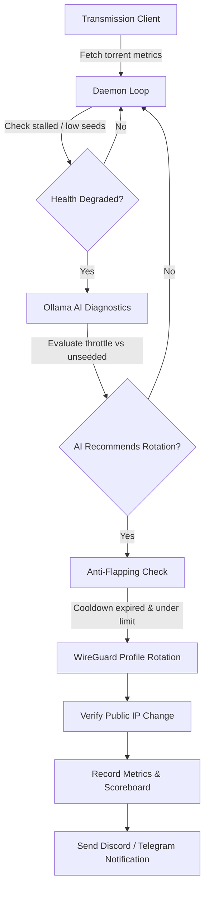

<p align="center">
  
</p>

<h1 align="center">Torrent Sentinel</h1>

<p align="center">
  <strong>Automated WireGuard VPN Rotation & Torrent Health Monitor with Local AI Diagnostics</strong>
</p>

<p align="center">
  <a href="https://github.com/nate-eisner/torrent-sentinel/actions/workflows/docker-publish.yml">
    
  </a>
  <a href="https://ghcr.io/nate-eisner/torrent-sentinel">
    
  </a>
  <a href="https://github.com/nate-eisner/torrent-sentinel/blob/main/LICENSE">
    
  </a>
  <a href="https://python-poetry.org/">
    
  </a>
</p>

---

## ⚡ What is Torrent Sentinel?

**Torrent Sentinel** is an intelligent background daemon designed for **Unraid** and Docker environments. It continuously observes your **Transmission** client, detects stalled or throttled downloads, and uses a **local LLM (via Ollama)** to assess network conditions and determine whether VPN performance is degraded.

When degradation is confirmed, Torrent Sentinel automatically rotates your WireGuard VPN endpoint to an optimal server, verifies that the public IP has safely changed, and records performance deltas into a persistent SQLite scoreboard to avoid flapping.

---

## ✨ Features

- 🛡️ **Automated WireGuard VPN Rotation**: Automatically manages and switches WireGuard tunnels (`wg1`) using pre-configured `.conf` profiles.
- 🧠 **Local AI Diagnostics (Ollama)**: Consults local LLMs (such as `gemma4:26b` or `llama3.2`) to distinguish between naturally slow or unseeded torrents vs. VPN bandwidth throttling and peering bottlenecks.
- 🔄 **Anti-Flapping & Cooldown Guards**: Configurable cooldowns, grace periods, and hourly rotation caps prevent tunnel thrashing.
- 🌐 **IP Leak & Verification Engine**: Validates that public IPs safely transition after each rotation and never leak back to the host WAN interface.
- 📊 **Historical Scoreboard**: Records location success rates, peer counts before and after rotation, and average transfer improvements in SQLite (`sentinel.db`).
- 🔔 **Multi-Channel Alerts**: Instant notifications via **Discord Webhooks** and **Telegram Bots**.
- 🚀 **REST API**: Built-in FastAPI endpoints to inspect active torrents, query rotation history, and manually trigger rotation.
- 📦 **Unraid Ready**: Includes native Unraid Docker XML template with full Community Applications support.

---

## 🏗️ Architecture Flow



---

## 🚀 Quick Start

### 1. Unraid (Recommended)

1. **Option A: USB Template Install**
   Copy [`torrent-sentinel.xml`](./torrent-sentinel.xml) to your Unraid flash drive:
   ```bash
   /boot/config/plugins/dockerMan/templates-user/torrent-sentinel.xml
   ```
   Open the Unraid WebUI &rarr; **Docker** &rarr; **Add Container** &rarr; select **torrent-sentinel**.

2. **Option B: Add Template Repository URL**
   In Unraid Docker settings, add:
   ```text
   https://raw.githubusercontent.com/nate-eisner/torrent-sentinel/main/torrent-sentinel.xml
   ```

---

### 2. Docker Compose

Create a `docker-compose.yml`:

```yaml
version: '3.8'

services:
  torrent-sentinel:
    image: ghcr.io/nate-eisner/torrent-sentinel:latest
    container_name: torrent-sentinel
    restart: unless-stopped
    cap_add:
      - NET_ADMIN
    ports:
      - "8000:8000"
    environment:
      # Transmission RPC
      - SENTINEL_TRANSMISSION_HOST=192.168.0.X
      - SENTINEL_TRANSMISSION_PORT=9091
      - SENTINEL_TRANSMISSION_RPC_PATH=/transmission/rpc
      - SENTINEL_TRANSMISSION_AUTH=
      
      # Ollama AI
      - SENTINEL_OLLAMA_ENABLED=true
      - SENTINEL_OLLAMA_BASE_URL=http://192.168.0.10:11434
      - SENTINEL_OLLAMA_MODEL=gemma4:26b
      
      # VPN Configuration
      - SENTINEL_VPN_TYPE=unraid_wireguard
      - SENTINEL_VPN_INTERFACE=wg1
      - SENTINEL_VPN_CONFIGS_DIR=/app/vpn_configs/
      - SENTINEL_VPN_ACTIVE_CONFIG=/app/vpn_configs/active.conf
      
      # Notifications (Optional)
      - SENTINEL_DISCORD_WEBHOOK_URL=
      - SENTINEL_TELEGRAM_BOT_TOKEN=
      - SENTINEL_TELEGRAM_CHAT_ID=
    volumes:
      - /mnt/user/appdata/torrent-sentinel/vpn_configs:/app/vpn_configs
      - /mnt/user/appdata/torrent-sentinel/data:/app/data
    command: ["run"]
```

Run:
```bash
docker compose up -d
```

---

### 3. Local / Manual CLI Deployment

```bash
# Clone repository
git clone https://github.com/nate-eisner/torrent-sentinel.git
cd torrent-sentinel

# Install dependencies with Poetry
poetry install

# Run the daemon
poetry run torrent-sentinel run

# View recent rotation history
poetry run torrent-sentinel history

# Test connection to Ollama
poetry run torrent-sentinel test-ollama
```

---

## ⚙️ Configuration Reference

All settings can be configured via environment variables with prefix `SENTINEL_`:

| Variable | Type | Default | Description |
| :--- | :--- | :--- | :--- |
| `SENTINEL_TRANSMISSION_HOST` | String | `localhost` | Hostname or IP of Transmission |
| `SENTINEL_TRANSMISSION_PORT` | Int | `9091` | Transmission RPC port |
| `SENTINEL_TRANSMISSION_RPC_PATH`| String | `/transmission/rpc` | RPC endpoint path |
| `SENTINEL_TRANSMISSION_AUTH` | String | `None` | RPC credentials (`username:password`) |
| `SENTINEL_OLLAMA_ENABLED` | Bool | `true` | Enable LLM diagnostics |
| `SENTINEL_OLLAMA_BASE_URL` | String | `http://192.168.0.10:11434` | Ollama API endpoint |
| `SENTINEL_OLLAMA_MODEL` | String | `gemma4:26b` | Model name for diagnostics |
| `SENTINEL_OLLAMA_TIMEOUT` | Int | `300` | Ollama request timeout in seconds |
| `SENTINEL_VPN_TYPE` | String | `unraid_wireguard`| Adapter (`unraid_wireguard`, `mock`, `command`) |
| `SENTINEL_VPN_INTERFACE` | String | `wg1` | Target WireGuard interface on host |
| `SENTINEL_VPN_CONFIGS_DIR` | String | `/mnt/user/...` | Directory with WireGuard `.conf` profiles |
| `SENTINEL_VPN_ACTIVE_CONFIG` | String | `/.../active.conf` | Target active configuration path |
| `SENTINEL_MIN_SEEDS` | Int | `2` | Minimum seeds before considering stalled |
| `SENTINEL_MIN_DOWNLOAD_RATE_KBPS` | Float | `15.0` | Minimum transfer rate before diagnosing |
| `SENTINEL_STALLED_DURATION_MINUTES` | Int | `5` | Minutes without progress before action |
| `SENTINEL_ROTATION_COOLDOWN_MINUTES` | Int | `15` | Minimum cooldown between rotations |
| `SENTINEL_POST_ROTATION_GRACE_PERIOD_MINUTES` | Int | `3` | Grace period after rotation |
| `SENTINEL_MAX_ROTATIONS_PER_HOUR` | Int | `4` | Maximum allowable rotations per hour |
| `SENTINEL_DISCORD_WEBHOOK_URL` | String | `None` | Discord webhook URL |
| `SENTINEL_TELEGRAM_BOT_TOKEN` | String | `None` | Telegram bot API token |
| `SENTINEL_TELEGRAM_CHAT_ID` | String | `None` | Telegram chat ID |

---

## 📡 REST API Reference

When running, Torrent Sentinel provides an HTTP API on port `8000`:

| Endpoint | Method | Description |
| :--- | :--- | :--- |
| `/api/status` | `GET` | Current daemon health, active torrent count, active VPN location |
| `/api/torrents` | `GET` | Real-time list of monitored torrents and transfer speeds |
| `/api/history` | `GET` | Log of past rotation events, triggers, and peer count deltas |
| `/api/scoreboard` | `GET` | VPN location reliability and performance scores |
| `/api/rotate` | `POST` | Manually trigger a rotation to an alternative VPN profile |

Interactive Swagger documentation is available at `http://<host>:8000/docs`.

---

## 🧪 Testing

Run unit and integration tests with pytest:

```bash
poetry run pytest
```

---

## 📄 License

Distributed under the MIT License. See [`LICENSE`](./LICENSE) for details.
